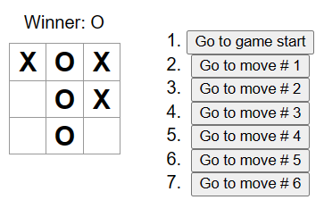

# Tic-Tac-Toe React Project



[ReactJS - Tutorial Tic-Tac-Toe](https://beta.es.reactjs.org/learn/tutorial-tic-tac-toe#taking-turns)

* Lets you play tic-tac-toe,
* Indicates when a player has won the game,
* Stores a game’s history as a game progresses,
* Allows players to review a game’s history and see previous versions of a game’s board.

## React with Bun runtime

This is a React project bootstrapped with [bun](https://bun.sh/).

## Getting Started

### Cloning the repo

```sh
git clone https://github.com/rivasjoaquin02/tic-tac-toe
```

### Development

First, run the development server.

```
bun dev
```

Open <http://localhost:3000> with your browser to see the result.
